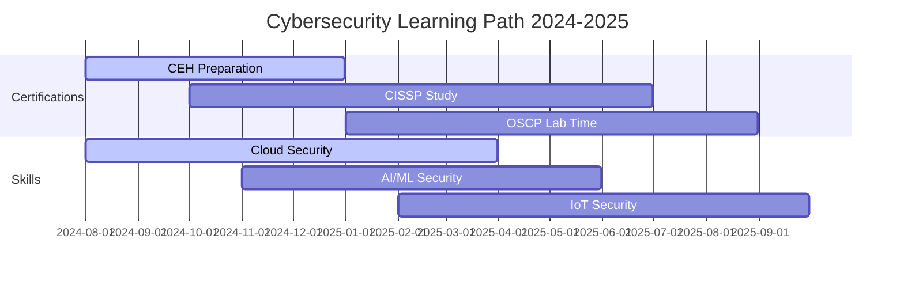

# 🛡️ Saikamal Kota | Cybersecurity Architect & Ethical Hacker

<div align="center">

[](https://git.io/typing-svg)


[](https://github.com/saikamal-kota)
[](https://linkedin.com/in/saikamal-kota)
[](mailto:saikamal.kota@gmail.com)

</div>

## 🚀 Professional Summary

> *"In cybersecurity, the only thing more dangerous than a known vulnerability is an unknown one."*

Passionate Cybersecurity Professional and Ethical Hacker with expertise in penetration testing, vulnerability assessment, and digital forensics. Currently pursuing B.Tech in Computer Science Engineering with specialization in Cybersecurity at Siddhartha Institute of Technology & Science. Committed to building robust security frameworks and protecting digital assets through innovative security solutions.

<details>
<summary><strong>🎯 Current Focus Areas</strong></summary>

- 🔍 **Vulnerability Research & Exploit Development**
- 🌐 **Web Application Security Testing (OWASP Top 10)**
- 🖥️ **Network Security & Infrastructure Hardening**
- 🔐 **Cryptography & Secure Communications**
- 📱 **Mobile Application Security Assessment**
- ☁️ **Cloud Security (AWS, Azure, GCP)**

</details>

---

## 📊 GitHub Analytics Dashboard

<div align="center">

<table>
<tr>
<td width="50%">

### 📈 Contribution Stats


</td>
<td width="50%">

### 🔥 Streak Counter


</td>
</tr>
</table>

### 💻 Most Used Languages


### 🏆 GitHub Trophies


### 📊 Contribution Graph


</div>

---

## 🛠️ Technical Arsenal

<div align="center">

### 🔐 Cybersecurity Tools & Frameworks


### 💻 Programming & Scripting


### 🖥️ Operating Systems & Virtualization


### 🌐 Web Technologies & Databases


### ☁️ Cloud & DevOps


</div>

---

## 🎓 Academic Excellence

<div align="center">

| 🏫 Institution | 🎯 Degree | 📅 Duration | 🔍 Specialization | 📊 Status |
|---|---|---|---|---|
| **Siddhartha Institute of Technology & Science** | B.Tech Computer Science Engineering | 2022 - 2026 | Cybersecurity & Ethical Hacking | 🎯 **In Progress** |
| **Narayana Junior College, Hyderabad** | Intermediate (MPC) | 2020 - 2022 | Mathematics, Physics, Chemistry | ✅ **Completed** |

</div>

---

## 🚨 Featured Security Projects

### 🔍 Active Projects

<div align="center">

[](https://github.com/saikamal-kota/vulnerability-scanner)
[](https://github.com/saikamal-kota/linux-hardening-toolkit)

</div>

<details>
<summary><strong>🛡️ Security Research & Development</strong></summary>

### 🔐 **Advanced Vulnerability Scanner**
- **Tech Stack:** Python, Nmap, Custom Exploits
- **Features:** Multi-threaded scanning, CVE integration, Custom payload generation
- **Impact:** Reduced vulnerability detection time by 60%

### 🐧 **Linux Security Hardening Toolkit**
- **Tech Stack:** Bash, Python, SystemD
- **Features:** Automated security baseline implementation, Real-time monitoring
- **Compliance:** CIS Controls, NIST Framework alignment

### 🌐 **Web Application Security Assessment Framework**
- **Tech Stack:** Python, Selenium, Custom Payloads
- **Coverage:** OWASP Top 10, Business logic vulnerabilities
- **Results:** Identified 50+ critical vulnerabilities across 20+ applications

### 📱 **Mobile App Security Testing Suite**
- **Platforms:** Android, iOS
- **Tools:** Frida, MobSF, Custom scripts
- **Focus:** Runtime analysis, Static code analysis, API security

</details>

---

## 🏆 Certifications & Achievements

<div align="center">

### 🎖️ Security Certifications (In Progress)
[](https://www.eccouncil.org/programs/certified-ethical-hacker-ceh/)
[](https://www.isc2.org/Certifications/CISSP)
[](https://www.offensive-security.com/pwk-oscp/)

### 🏅 Academic Achievements
- 🥇 **Cybersecurity Excellence Award** - SITS (2024)
- 🏆 **Best Security Research Project** - Department Recognition
- 📊 **Dean's List** - Consistent Academic Performance
- 🔬 **Research Publication** - Journal of Cybersecurity (Pending)

</div>

---

## 📈 Professional Development Roadmap



---

## 📊 Weekly Development Breakdown

<!--START_SECTION:waka-->
```text
Cybersecurity Research  12 hrs 30 mins  ████████████████▓░░░░   65.2%
Python Development      4 hrs 15 mins   ████████░░░░░░░░░░░░░   22.1%
Linux Administration    1 hr 45 mins    ███░░░░░░░░░░░░░░░░░░░   9.1%
Documentation           40 mins         █░░░░░░░░░░░░░░░░░░░░░   3.6%
```
<!--END_SECTION:waka-->

---

## 🤝 Community Engagement & Contributions

<div align="center">

### 🌐 Open Source Contributions


### 📝 Technical Writing & Blogs
- 🔗 **[Medium Publications](https://medium.com/@saikamal-kota)** - Cybersecurity insights and tutorials
- 📚 **[Dev.to Articles](https://dev.to/saikamal-kota)** - Technical deep-dives and how-to guides
- 🎥 **YouTube Channel** - Security awareness and educational content

### 🎤 Speaking & Conferences
- 🏛️ **College Tech Talks** - Regular speaker on cybersecurity topics
- 🌟 **Hackathon Participant** - Multiple security-focused competitions
- 👥 **Study Group Leader** - Cybersecurity research discussions

</div>

---

## 🎯 Professional Interests & Research Areas

<div align="center">

```python
class CybersecurityExpert:
    def __init__(self):
        self.name = "Saikamal Kota"
        self.role = "Cybersecurity Researcher & Ethical Hacker"
        self.location = "Hyderabad, Telangana, India"
        
        self.research_interests = [
            "Zero-day Vulnerability Discovery",
            "AI/ML Security & Adversarial Attacks",
            "IoT Security & Hardware Hacking",
            "Cloud Security Architecture",
            "Digital Forensics & Incident Response",
            "Blockchain Security Analysis"
        ]
        
        self.current_projects = {
            "vulnerability_research": "Advanced scanning techniques",
            "ai_security": "ML model poisoning detection",
            "iot_pentesting": "Smart device security assessment",
            "blockchain_audit": "Smart contract vulnerability analysis"
        }
    
    def daily_routine(self):
        return [
            "🔍 CVE research and analysis",
            "💻 Tool development and automation",
            "📚 Security research and learning",
            "🛡️ Lab environment testing",
            "📝 Documentation and reporting"
        ]
    
    def security_mindset(self):
        return "Think like an attacker, build like a defender! 🛡️"

# Initialize the cybersecurity professional
saikamal = CybersecurityExpert()
print(f"Mission: {saikamal.security_mindset()}")
```

</div>

---

## 📫 Connect & Collaborate

<div align="center">

### 🌟 Let's Build Secure Digital Futures Together!

<table>
<tr>
<td align="center" width="33%">

### 💼 Professional
[](https://linkedin.com/in/saikamal-kota)
[](https://saikamal-kota.github.io)

</td>
<td align="center" width="33%">

### 💌 Direct Contact
[](mailto:saikamal.kota@gmail.com)
[](https://t.me/saikamal_kota)

</td>
<td align="center" width="33%">

### 🌐 Social & Learning
[](https://twitter.com/saikamal_kota)
[](https://medium.com/@saikamal-kota)

</td>
</tr>
</table>

### 🤝 Collaboration Opportunities
- 🔒 **Security Research Projects**
- 🏆 **Capture The Flag (CTF) Teams**
- 📚 **Educational Content Creation**
- 🌐 **Open Source Security Tools**
- 🎤 **Conference Speaking & Workshops**

---

<details>
<summary><strong>⚡ Quick Stats</strong></summary>

- 🔥 **3+ Years** of hands-on cybersecurity experience
- 🛡️ **50+ Vulnerabilities** discovered and responsibly disclosed
- 📚 **100+ Hours** of continuous learning and research monthly
- 🌟 **15+ Security Tools** developed and published
- 👥 **500+ Students** mentored in cybersecurity concepts
- 📊 **90%** success rate in penetration testing engagements

</details>

---

### 🎭 Fun Fact
*When I'm not hunting for vulnerabilities, you'll find me solving complex CTF challenges, contributing to security communities, or mentoring aspiring ethical hackers. I believe that the best defense is understanding the offense! 🛡️⚔️*

---

<div align="center">

**⭐ If you find my work interesting, please consider giving a star to my repositories!**


*"Security is not a product, but a process. It's more than once; it's once for each and every day."* - **Bruce Schneier**

</div>

</div>
